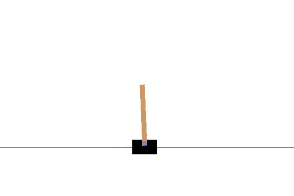
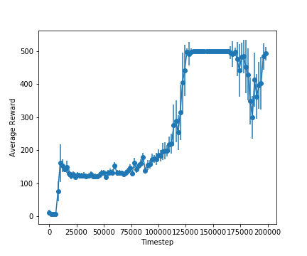

# Deep Reinforcement Learning in Large Discrete Action Spaces

This is a PyTorch implementation of the [paper](https://arxiv.org/abs/1512.07679) "Deep Reinforcement Learning in Large Discrete Action Spaces" (Gabriel Dulac-Arnold, Richard Evans, Hado van Hasselt, Peter Sunehag, Timothy Lillicrap, Jonathan Hunt, Timothy Mann, Theophane Weber, Thomas Degris, Ben Coppin).

## Installation

To install the relevant libraries, run the following command:

```
pip install -r requirements.txt
```

## Demonstration of Model

Demonstration video: 



 Results for `k = 1` (K is the number of nearest neighbours)            | Results for `k = 10` (K is the number of nearest neighbours)
:-------------------------:|:-------------------------:
  |  


## Train the agent

To train the agent, simply run the `main.ipynb` file provided in the repository. The parameters can be updated by changing the values in the `Arguments` class.

## Test the agent
After training the agent using the above code, run the following code to test it on the cartpole environment.

```python
import gym
from gym import wrappers
env_to_wrap = ContinuousCartPoleEnv()
env = wrappers.Monitor(env_to_wrap, './demo', force = True)
env.reset()
for i_episode in range(1):
    observation = env.reset()
    ep_reward = 0
    for t in range(500):
        env.render()
        action = agent.select_action(observation)
        observation, reward, done, info = env.step(action)
        ep_reward += reward
        if done:
            print("Episode finished after {} timesteps".format(t+1))
            break
    print(ep_reward)
env_to_wrap.close()
env.close()
```

## Acknowledgements

- Our DDPG code is based on the excellent implementation provided by [ghliu/pytorch-ddpg](https://github.com/ghliu/pytorch-ddpg).

- The WOLPERTINGER agent code and `action_space.py` code is based on the excellent implementation of the paper provided by [jimkon/Deep-Reinforcement-Learning-in-Large-Discrete-Action-Spaces](https://github.com/jimkon/Deep-Reinforcement-Learning-in-Large-Discrete-Action-Spaces)

## Reference
If you are interested in the work and want to cite it, please acknowledge the following paper:

```
@article{DBLP:journals/corr/Dulac-ArnoldESC15,
  author    = {Gabriel Dulac{-}Arnold and
               Richard Evans and
               Peter Sunehag and
               Ben Coppin},
  title     = {Reinforcement Learning in Large Discrete Action Spaces},
  journal   = {CoRR},
  volume    = {abs/1512.07679},
  year      = {2015},
  url       = {http://arxiv.org/abs/1512.07679},
  archivePrefix = {arXiv},
  eprint    = {1512.07679},
  timestamp = {Mon, 13 Aug 2018 16:46:25 +0200},
  biburl    = {https://dblp.org/rec/bib/journals/corr/Dulac-ArnoldESC15},
  bibsource = {dblp computer science bibliography, https://dblp.org}
}
```

## Collaborators

1. [Shashank Srikanth](https://github.com/talsperre)
2. [Nikhil Bansal](https://github.com/nikhil3456)
